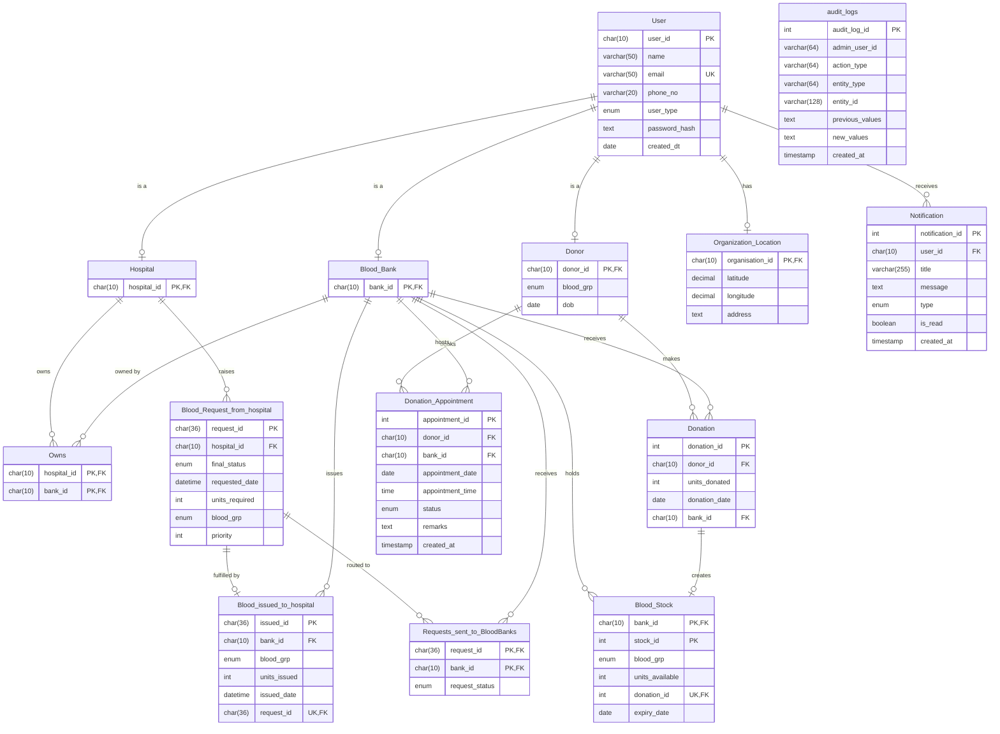

# 🩸 Blood Donation And Inventory Management System

<p align="center">
  
  
  
  
  
</p>

<p align="center">
  A full-stack web application for managing blood donations, appointments, inventory, and hospital requests — with role-based dashboards for Donors, Blood Banks, Hospitals, and Admins.
</p>

<p align="center">
  <a href="#-overview">Overview</a> •
  <a href="#-features">Features</a> •
  <a href="#-tech-stack">Tech Stack</a> •
  <a href="#-architecture">Architecture</a> •
  <a href="#-database-schema">Database</a> •
  <a href="#-getting-started">Getting Started</a> •
  <a href="#-api-routes">API Routes</a> •
  <a href="#-project-structure">Structure</a> •
  <a href="#-contributing">Contributing</a>
</p>

---

## 📌 Overview

The **Blood Donation Management System (BDMS)** is a full-stack web application that digitises and streamlines blood donation workflows. It connects **donors**, **blood banks**, and **hospitals** on a single platform with role-specific dashboards, real-time inventory tracking, donation appointments, in-app notifications, and a complete request-fulfillment pipeline. Admins get system-wide oversight backed by an audit trail.

### ✨ At a Glance

| Role | What They Can Do |
|---|---|
| 🧑 Donor | View profile, track donation history, check eligibility, book and manage donation appointments |
| 🏦 Blood Bank | Record donations, manage inventory, approve/reject appointments, fulfill/reject hospital requests |
| 🏥 Hospital | Search nearby blood banks, send blood requests, track request status, draw from its own blood bank (if it owns one) |
| 🛡️ Admin | Manage users, requests, and stock across the system; review audit logs and appointments |
| 🌐 Public (no login) | Landing page with live platform stats and a nearby blood bank finder |

---

## 🔧 Features

### 🔐 Authentication & Access Control
- JWT-based authentication with Bearer token in request headers (tokens expire after **1 hour**)
- **Login with email or user ID** — the token carries `user_id`, `user_type`, and `bank_id`
- Role-based access control via **ID prefix** — user IDs are prefixed with `DNR`, `BNK`, `HSP`, or `ADM` and enforced on every protected route
- Public signup is limited to **donor / hospital / blood_bank** — admin accounts can only be created by an existing admin
- Authenticated **change password** from the profile page
- Protected routes on both frontend (React Router guards) and backend (middleware chain)
- > ℹ️ The forgot-password / reset-password flow (30-minute in-memory token) is currently **disabled** — the code is kept commented out in `passwordResetControllers.js`, `authRoutes.js`, and `App.jsx` so it can be re-enabled later.

### 🧑 Donor
- Profile setup with blood group and date of birth
- **Donation eligibility check** — enforces a 90-day cooldown between donations
- Full donation history with dates and units donated
- **Appointment booking** — pick a blood bank (with unexpired stock), date, and time; view and cancel your own appointments

### 🏦 Blood Bank
- **Add donations** — verifies donor ID, checks eligibility, validates blood group match, and records stock atomically in a single DB transaction
- **Inventory management** — view stock by blood group and per entry, adjust units, and write off entries
- **Request handling** — fulfill or reject incoming hospital requests; fulfillment deducts stock transactionally, **oldest stock first (FIFO)**
- **Appointment handling** — approve, reject, or complete donor appointments
- Dashboard stats — total units, pending requests, donations this month, low-stock blood groups
- **Expiry handling** — blood is treated as expired **42 days after the donation date**; expired units are excluded from totals, search results, and fulfillment. Low stock threshold is 5 units (see `config/bloodConfig.js`)

### 🏥 Hospital
- **Find blood banks** — search banks by blood group and units, sorted by distance (Haversine); the hospital's own bank is excluded
- **Send blood requests** — specify blood group, units required, and priority
- Multi-bank requests — a single request can be routed to multiple banks simultaneously; when one bank fulfills it, the remaining bank-level requests are auto-cancelled
- View all requests with per-bank status and cancel individual bank-level or entire requests
- Hospitals that own a blood bank get **bank views too** — own-bank inventory and a **"take from own bank"** flow that deducts stock and logs an auto-approved issue record

### 🛡️ Admin
- System-wide overview dashboard
- **User management** — list, view, create (admin), edit, enable/disable, and delete users
- **Request management** — view requests, approve/reject on behalf of a bank, or reassign to another bank
- **Stock management** — view, edit, adjust, expire, and delete stock entries
- View all donations, issued blood records, and appointments
- **Audit logs** — every admin mutation (user, request, and stock changes) is recorded with before/after values, filterable by action, entity, and admin

### 🔔 Notifications
In-app notifications with a navbar bell (unread count), mark-as-read, and mark-all-read. Triggered by:

| Event | Notified |
|---|---|
| New blood request sent | Each selected blood bank |
| Request approved / rejected / blood issued | Requesting hospital |
| Appointment booked | Blood bank |
| Appointment approved / rejected | Donor |
| Stock falls below the low-stock threshold after a donation | Blood bank |
| New user registration | All admins |
| Large blood issue (≥ 10 units) | All admins |

### 🌐 Public Pages
- **Landing page** with live platform stats (users, donors, donations, requests)
- **Nearby banks** (`/nearby-banks`) — enter latitude, longitude, and radius to find banks with unexpired stock

---

## 🧰 Tech Stack

### Frontend
| Technology | Purpose |
|---|---|
| React 19 | UI framework |
| React Router DOM v7 | Client-side routing with role-protected routes |
| Axios | HTTP client with base URL config and JWT request interceptor |
| Vite 8 | Build tool and dev server |
| Context API | Global state — auth (token, role, bankId), toasts, notifications |

### Backend
| Technology | Purpose |
|---|---|
| Node.js + Express 5 | REST API server |
| MySQL2 | Database driver with connection pooling (limit: 50) |
| JWT (`jsonwebtoken`) | Stateless authentication |
| bcrypt | Password hashing (salt rounds: 10) |
| uuid v4 | Unique IDs for requests and issued-blood records |
| dotenv | Environment variable management |
| cors | Cross-origin requests from frontend (`localhost:5173`) |

---

## 🏛 Architecture

```
┌─────────────────────────────────────┐
│         React Frontend (Vite)       │
│  ┌───────────┐ ┌──────────────────┐ │
│  │AuthContext│ │RoleProtectedRoute│ │
│  └───────────┘ └──────────────────┘ │
│  ┌────────────────────────────────┐ │
│  │ ToastContext · NotificationCtx │ │
│  └────────────────────────────────┘ │
│         axios (with JWT header)     │
└──────────────────┬──────────────────┘
                   │ HTTP REST
┌──────────────────▼──────────────────┐
│         Express.js Backend          │
│  ┌────────────────────────────────┐ │
│  │         API Routes             │ │
│  │  /api/auth  /api/user          │ │
│  │  /api/setup /api/profile/status│ │
│  │  /api/donor /api/appointments  │ │
│  │  /api/bloodbank /api/hospital  │ │
│  │  /api/ownedbank /api/admin     │ │
│  │  /api/notifications            │ │
│  │  /api/public /api/bloodbanks   │ │
│  └──────────────┬─────────────────┘ │
│  ┌──────────────▼─────────────────┐ │
│  │        Middleware Chain        │ │
│  │ authMiddleware → roleMiddleware│ │
│  │      (or ownsBankMiddleware)   │ │
│  └──────────────┬─────────────────┘ │
│  ┌──────────────▼─────────────────┐ │
│  │         Controllers            │─┼──► Services (notificationService)
│  └──────────────┬─────────────────┘ │
│  ┌──────────────▼─────────────────┐ │
│  │           Models               │ │
│  │  (SQL queries via mysql2 pool) │ │
│  └──────────────┬─────────────────┘ │
└─────────────────┼───────────────────┘
                  │
┌─────────────────▼───────────────────┐
│            MySQL Database           │
│  User, Donor, Hospital, Blood_Bank  │
│  Organization_Location, Owns        │
│  Donation, Blood_Stock              │
│  Blood_Request_from_hospital        │
│  Requests_sent_to_BloodBanks        │
│  Blood_issued_to_hospital           │
│  Donation_Appointment               │
│  Notification, audit_logs           │
└─────────────────────────────────────┘
```

---

## 🧬 Database Schema

The database (`Blood_Donation_Management_System`) consists of 14 tables:



| Table | Description |
|---|---|
| `User` | Central user table — all roles share this; ID prefixed `DNR/HSP/BNK/ADM` (enforced by a `CHECK` constraint) |
| `Donor` | Donor profile — blood group, date of birth |
| `Hospital` | Hospital profile — linked to User |
| `Blood_Bank` | Blood bank profile — linked to User |
| `Organization_Location` | Lat/long coordinates and optional address for banks and hospitals |
| `Owns` | Hospital ↔ Blood Bank ownership mapping |
| `Donation` | Records each donation with donor, bank, units, and date |
| `Blood_Stock` | Per-donation stock entries — units available per blood group per bank |
| `Blood_Request_from_hospital` | Hospital blood requests (UUID `request_id`) with priority, blood group, units, and overall status |
| `Requests_sent_to_BloodBanks` | Per-bank status of each request (`Processing/Approved/Rejected/Cancelled`) |
| `Blood_issued_to_hospital` | Records of blood actually issued to hospitals (UUID `issued_id`, one per request) |
| `Donation_Appointment` | Donor appointments at a bank (`Pending/Approved/Rejected/Completed/Cancelled`) |
| `Notification` | Per-user in-app notifications (`REQUEST/DONATION/APPOINTMENT/INVENTORY/SYSTEM`) with read state |
| `audit_logs` | Admin action trail — action, entity, and JSON before/after values |

> Run `db.sql` to set up the full schema. It is a **single consolidated script** (it creates the database and all 14 tables) — the earlier incremental `backend/migrations/` folder is no longer part of the project.

> 🗂️ `User.is_active` (used by admin enable/disable) is not part of `db.sql`; the backend adds the column automatically the first time a user is enabled/disabled.

> 📐 The schema is normalized up to **Boyce-Codd Normal Form (BCNF)** — all functional dependencies are on superkeys, with no partial or transitive dependencies across tables.

---

## 🚀 Getting Started

### Prerequisites

- Node.js (v18+)
- MySQL (v8+)
- npm

### 1. Clone the Repository

```bash
git clone https://github.com/Krishna-2105/Blood-Donation-And-Inventory-Management-System
cd Blood-Donation-And-Inventory-Management-System
```

### 2. Set Up the Database

```bash
mysql -u root -p < db.sql
```

This creates the `Blood_Donation_Management_System` database along with all tables.

### 3. Configure the Backend

```bash
cd backend
cp .env.example .env
```

Edit `.env`:

```env
PORT=3000
DB_HOST=localhost
DB_USER=root
DB_PASSWORD=your_password
DB_NAME=Blood_Donation_Management_System
JWT_SECRET=your_jwt_secret
```

Install dependencies and start:

```bash
npm install
npm start
```

The backend runs on `http://localhost:3000`.

### 4. Start the Frontend

```bash
cd ../frontend
npm install
npm run dev
```

The frontend runs on `http://localhost:5173` (the API base URL is set in `src/api/axios.js`).

### 5. Create the First Admin

Public signup cannot create admins, so seed the first one manually. Generate a bcrypt hash from the `backend` folder:

```bash
node -e "require('bcrypt').hash('YourPassword', 10).then(console.log)"
```

Then insert the user (the ID must start with `ADM`):

```sql
INSERT INTO `User` (user_id, name, email, phone_no, user_type, password_hash)
VALUES ('ADM000001', 'Admin', 'admin@example.com', '0000000000', 'admin', '<paste-hash-here>');
```

Further admins can be created from the admin API (`POST /api/admin/users`).

---

## 📡 API Routes

All protected routes require the header: `Authorization: Bearer <token>`

### Auth — `/api/auth`

| Method | Route | Description |
|---|---|---|
| POST | `/login` | Login with email or user ID and receive JWT |
| POST | `/signup` | Register a new user (donor / hospital / blood_bank) |

> `/forgot-password` and `/reset-password` are disabled (commented out).

### User — `/api/user` *(any authenticated user)*

| Method | Route | Description |
|---|---|---|
| GET | `/profile` | Get base profile plus role-specific details (blood group/DOB or location) |
| PUT | `/change-password` | Change password (requires old password) |

### Profile Setup & Status — `/api/setup`, `/api/profile/status`

| Method | Route | Description |
|---|---|---|
| POST | `/api/setup/donor` *(DNR)* | Complete donor profile (blood group, DOB) |
| POST | `/api/setup/bloodbank` *(BNK)* | Complete blood bank profile (location) |
| POST | `/api/setup/hospital` *(HSP)* | Complete hospital profile; optionally creates an owned blood bank in the same transaction |
| GET | `/api/profile/status` | Whether the current user's profile setup is complete |

### Donor — `/api/donor` *(role: DNR)*

| Method | Route | Description |
|---|---|---|
| GET | `/profile` | Get donor profile |
| GET | `/history` | Get donation history |
| GET | `/lastdt` | Get last donation date |
| GET | `/eligibility` | Check eligibility and next eligible date |

### Appointments — `/api/appointments`

| Method | Route | Role | Description |
|---|---|---|---|
| POST | `/` | DNR | Book an appointment (2–30 days ahead, one per date) |
| GET | `/me` | DNR | View my appointments |
| PUT | `/cancel/:appointment_id` | DNR | Cancel a pending appointment |
| GET | `/bank/:bank_id` | BNK | View appointments for the bank |
| PATCH | `/bank/:appointment_id/status` | BNK | Set status to `Approved`, `Rejected`, or `Completed` |
| GET | `/all` | ADM | View all appointments |

### Blood Bank — `/api/bloodbank` *(role: BNK)*

| Method | Route | Description |
|---|---|---|
| GET | `/` | Dashboard stats |
| GET | `/inventory` | View blood stock |
| GET | `/requests` | View incoming hospital requests |
| GET | `/donations` | View donation history |
| GET | `/donor/:donor_id` | Check donor eligibility |
| POST | `/donation` | Record a new donation (transactional) |
| POST | `/request/:request_id/fulfill` | Fulfill a request (deducts stock transactionally) |
| POST | `/request/:request_id/reject` | Reject a request |
| PUT | `/inventory/adjust` | Adjust stock units |
| DELETE | `/inventory/:stock_id` | Write off a stock entry |

### Hospital — `/api/hospital` *(role: HSP)*

| Method | Route | Description |
|---|---|---|
| GET | `/dashboard` | Dashboard stats |
| GET | `/find-banks` | Search blood banks by blood group / units, sorted by distance |
| GET | `/requests` | View all requests made by this hospital |
| POST | `/send-request` | Send a blood request to one or more banks |
| PUT | `/cancel/:request_id` | Cancel an entire request |
| PUT | `/cancel/:request_id/:bank_id` | Cancel request for a specific bank |
| GET | `/incoming/:bank_id` *(BNK)* | Incoming requests for a bank |

### Owned Blood Bank — `/api/ownedbank` *(role: HSP that owns a bank)*

Guarded by `ownsBankMiddleware`, which resolves the hospital's bank from the `Owns` table.

| Method | Route | Description |
|---|---|---|
| GET | `/dashboard` | Owned bank dashboard stats |
| GET | `/inventory` | View owned bank stock |
| GET | `/requests` | View requests routed to the owned bank |
| GET | `/donations` | View owned bank donation history |
| POST | `/donation` | Record a donation at the owned bank |
| POST | `/request/:request_id/fulfill` | Fulfill a request |
| POST | `/request/:request_id/reject` | Reject a request |
| PUT | `/inventory/adjust` | Adjust stock units |
| DELETE | `/inventory/:stock_id` | Write off a stock entry |
| POST | `/use-stock` | Take blood from the owned bank for internal use (logs an auto-approved request + issue record) |

### Notifications — `/api/notifications` *(any authenticated user)*

| Method | Route | Description |
|---|---|---|
| GET | `/` | List notifications (`limit` up to 200, `offset`) with unread count |
| GET | `/unread-count` | Get unread count |
| PATCH | `/:id/read` | Mark one notification as read |
| PATCH | `/read-all` | Mark all notifications as read |

### Public — `/api/public`, `/api/bloodbanks` *(no auth)*

| Method | Route | Description |
|---|---|---|
| GET | `/api/public/stats` | Platform counts (users, donors, donations, requests) |
| GET | `/api/public/banks` | Banks that currently hold unexpired stock |
| GET | `/api/public/banks/nearby` | Nearby banks by `latitude`, `longitude`, `radius` (km) |
| GET | `/api/bloodbanks/nearby` | Same nearby search (alias) |

### Admin — `/api/admin` *(role: ADM)*

| Method | Route | Description |
|---|---|---|
| GET | `/dashboard` | System-wide dashboard |
| GET | `/users` | List users (`role`, `page`, `limit`) |
| POST | `/users` | Create an admin user |
| GET | `/users/:id` | Get a user |
| PUT | `/users/:id` | Update a user |
| PATCH | `/users/:id/status` | Enable / disable a user (`is_active`) |
| DELETE | `/users/:id` | Delete a user |
| GET | `/donations` | All donations |
| GET | `/requests` | All blood requests |
| GET | `/requests/:id` | Get a request |
| PATCH | `/requests/:id/approve` | Approve/fulfill on behalf of a bank (`bank_id` in body) |
| PATCH | `/requests/:id/reject` | Reject on behalf of a bank (`bank_id` in body) |
| PATCH | `/requests/:id/reassign` | Reassign to another bank (`to_bank_id`, optional `from_bank_id`) |
| GET | `/stock` | Unexpired stock summary per bank and blood group |
| GET | `/issued` | All blood issued records |
| GET | `/blood-stock` | List stock entries (`blood_grp`, `bank_id`, `page`, `limit`) |
| GET | `/blood-stock/:id` | Get a stock entry |
| PUT | `/blood-stock/:id` | Update a stock entry |
| PATCH | `/blood-stock/:id/adjust` | Adjust stock units |
| PATCH | `/blood-stock/:id/expire` | Mark a stock entry as expired |
| DELETE | `/blood-stock/:id` | Delete a stock entry |
| GET | `/audit-logs` | List audit logs (filter by action, entity, admin, search) |
| GET | `/audit-logs/:id` | Get one audit log with before/after values |

---

## 📁 Project Structure

```
Blood-Donation-And-Inventory-Management-System/
├── db.sql                              # Consolidated MySQL schema (14 tables)
├── README.md
├── backend/
└── frontend/


backend/
├── server.js                           # Express app — mounts all routes
├── .env                                # Environment variables (git-ignored)
├── .env.example                        # Template for .env
├── config/
│   ├── db.js                           # MySQL connection pool (limit: 50)
│   └── bloodConfig.js                  # Expiry (42 days), warn (7 days), low stock (5 units), large transaction (10 units)
├── middleware/
│   ├── authMiddleWare.js               # JWT verification
│   ├── roleMiddleWare.js               # Role check via user_id prefix
│   └── ownsBankMiddleware.js           # Verifies hospital owns a bank; sets req.bank_id
├── Routes/                             # Express routers (auth, user, donor, appointment, bloodBank,
│                                       #   hospital, ownedBank, admin, notification, public, bank,
│                                       #   profileSetup, profileStatus)
├── controllers/                        # Request handlers — business logic
├── models/                             # SQL query functions (raw mysql2)
│   ├── auditModels.js                  # Audit log writes/reads
│   ├── appointmentModels.js            # Appointment queries
│   └── notificationModels.js           # Notification queries
├── services/
│   └── notificationService.js          # Notification triggers (requests, appointments, low stock, admin alerts)
└── scripts/
    └── run_migration.js                # Helper to run a .sql file from a migrations/ folder


frontend/
├── index.html
└── src/
    ├── App.jsx                         # All routes with role guards
    ├── main.jsx                        # App entry with AuthProvider, ToastProvider, NotificationProvider
    ├── index.css
    ├── api/
    │   ├── axios.js                    # Axios instance with base URL + JWT interceptor
    │   └── notificationApi.js          # Notification API helpers
    ├── context/
    │   ├── AuthContext.jsx             # Global auth state (token, role, hasBloodBank, bankId)
    │   ├── ToastContext.jsx            # Global toast notifications
    │   └── NotificationContext.jsx     # Unread count + notification state
    ├── components/
    │   ├── Navbar.jsx
    │   ├── Sidebar.jsx                 # Role-aware navigation
    │   ├── NotificationBell.jsx
    │   └── Toast.jsx
    ├── ui/                             # Reusable primitives: Badge, Button, Card, EmptyState, Input
    ├── styles/
    │   └── auth.css
    ├── utils/
    │   └── formatDate.js               # (getUserType.js, roleRoutes.js are currently unused)
    ├── routes/
    │   ├── ProtectedRoute.jsx          # Blocks unauthenticated access
    │   └── RoleProtectedRoute.jsx      # Blocks wrong-role access (optional requireBank)
    └── pages/
        ├── Landing.jsx                 # Public landing page with live stats
        ├── Layouts/
        │   └── DashboardLayout.jsx     # Shared layout wrapper for all dashboards
        ├── public/
        │   └── NearbyBanks.jsx         # Public nearby blood bank finder
        ├── auth/                       # Login, Signup (ForgotPassword, ResetPassword are disabled)
        ├── setup/                      # Profile setup for Donor, Hospital, BloodBank
        └── dashboard/
            ├── UserProfile.jsx
            ├── Notifications.jsx
            ├── DashboardRouter.jsx     # Renders the correct home dashboard based on role
            ├── admin/                  # AdminDashboard, AdminProfile, AdminUsers, AdminDonations,
            │                           #   AdminRequests, AdminStock, AdminIssued, AdminAuditLogs,
            │                           #   AdminAppointments
            ├── donor/                  # DonorHome, DonorProfile, DonorHistory,
            │                           #   BookAppointment, DonorAppointments
            ├── hospital/               # HospitalHome, HospitalRequest, HospitalRequests,
            │                           #   FindBloodBanks, HospitalOwnBank
            └── bloodbank/              # BloodBankHome, BloodInventory, Donations, Requests,
                                        #   AddDonation, BankAppointments, OwnedBankInventory
```

> 🧹 A few files are currently not referenced by any route and can be removed or revived later: `DonorDashboard.jsx`, `HospitalDashboard.jsx`, `HospitalWithBank.jsx`, `OwnedBankAddDonation.jsx`, `OwnedBankDonations.jsx`, `OwnedBankRequests.jsx`.

---

## 🤝 Contributing

1. Fork the repository
2. Create a new branch: `git checkout -b feature/your-feature`
3. Commit your changes: `git commit -m "Add: short description"`
4. Push and open a Pull Request

---

<p align="center">
  Built with 💙 &nbsp;|&nbsp;
  <a href="<your-repo-url>/issues">Report an Issue</a>
</p>